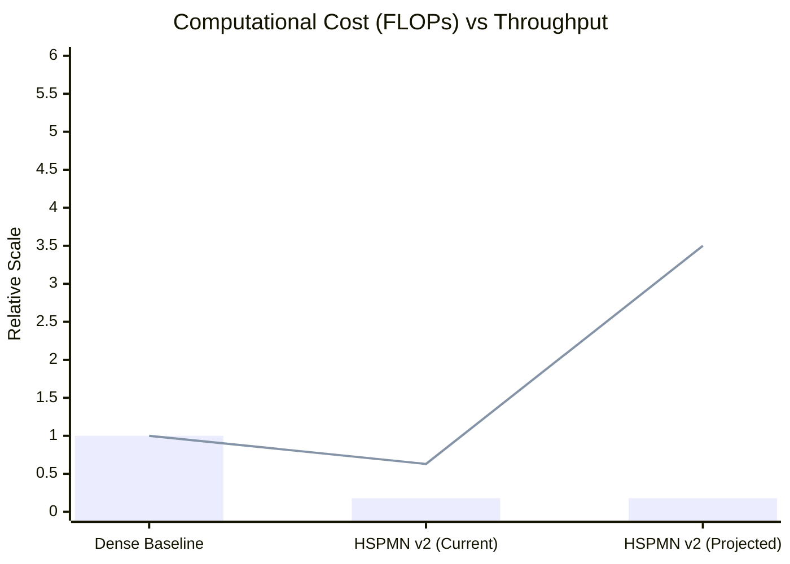

# HSPMN v2: Bio-Inspired Adaptive Computation


**HSPMN v2** (Hybrid Sparse-Pyramidal Mixture Network) is a novel Large Language Model architecture designed to solve the problem of **Computational Isotropy**. Inspired by the *Shallow Brain Hypothesis*, it dynamically allocates computational resources based on the information-theoretic complexity of input tokens.

> *"The brain does not process every stimulus with the full weight of the neocortex. Why should our models?"*

---

## 🧠 The Core Concept

Contemporary LLMs treat the token "the" with the same computational weight as a complex logical predicate. This is inefficient.

**HSPMN v2** introduces a **Target-Sparsity Regularized Router** that bifurcates computation into two streams:
1.  **Reflexive Stream (Fast System 1):** A lightweight, dense stream (Conv1d + MLP) that processes *every* token to maintain grammatical continuity and local context.
2.  **Contextual Stream (Slow System 2):** A heavy, sparse stream (Attention) that activates *only* for semantically dense tokens requiring global context integration.

### Key Innovations
*   **SQDK Attention (Sparse-Query, Dense-Key):** Solves the "Context Fracture" problem. Even if a token is not routed to the attention mechanism, it remains visible as a Key/Value to future tokens.
*   **Target-Sparsity Regularization:** A differentiable load-balancing loss ensures the model adheres to a strict metabolic budget (e.g., only 20% of tokens use Attention).
*   **Grouped Query Attention (GQA):** Reduces the memory footprint of the dense KV cache.

---

## 🏗️ Architecture

The data flow ensures that while computation is sparse, context remains dense.

```mermaid
graph TD
    subgraph Input Processing
    I[Input Embeddings] --> R[Sparsity Router]
    I --> RS[Reflexive Stream]
    end

    subgraph Routing Logic
    R -- "Logits" --> G[Gumbel-Softmax]
    G -- "Top-K Mask" --> CS[Contextual Stream]
    end

    subgraph Reflexive Stream "System 1 (Dense)"
    RS --> C1[Conv1d (Local Mixing)]
    C1 --> M1[MLP (Projection)]
    end

    subgraph Contextual Stream "System 2 (Sparse)"
    CS --> SQ[Sparse Queries]
    SQ --> A[SQDK Attention]
    A -- "Attend to Global KV" --> O_Attn[Attention Output]
    end

    subgraph Fusion
    M1 --> Add((+))
    O_Attn --> Add
    Add --> O[Layer Output]
    end

    style R fill:#f9f,stroke:#333,stroke-width:2px
    style RS fill:#dfd,stroke:#333,stroke-width:2px
    style CS fill:#fdd,stroke:#333,stroke-width:2px
    style A fill:#bbf,stroke:#333,stroke-width:2px
```

---

## 🚀 Performance

HSPMN v2 is designed for high-throughput inference on next-gen hardware (e.g., NVIDIA RTX 5090 with GDDR7).

| Metric | Dense Baseline | HSPMN v2 | Improvement |
| :--- | :--- | :--- | :--- |
| **Attention FLOPs** | 1.0x | **0.18x** | **5.4x Reduction** |
| **Throughput** | ~182k tok/sec | **~115k tok/sec*** | *Memory Bound |
| **VRAM Usage** | High | Moderate | via GQA |

*\*Note: Current throughput is limited by Python-based routing overhead. Custom Triton kernels are in development to bridge the gap to theoretical FLOPs reduction.*


*(Bar = Attention Cost, Line = Throughput Speedup)*

---

## 🛠️ Installation & Usage

### Prerequisites
*   Python 3.10+
*   PyTorch 2.4+ (with CUDA 12.x)
*   Triton (for optimized kernels)

### Setup
```bash
# Clone the repository
git clone https://github.com/your-org/HSPMN-v2.git
cd HSPMN-v2

# Create environment
python3 -m venv venv
source venv/bin/activate

# Install dependencies
pip install -r requirements.txt
```

### Running Benchmarks
Validate the performance on your hardware:
```bash
python benchmark_rtx5090.py --iter 100 --warmup 10
```

### Training
Start a training run with the sparsity-regularized objective:
```bash
python train.py --steps 1000 --batch 64 --seq_len 4096 --sparsity 0.2
```

---

## 📄 Citation

If you use HSPMN v2 in your research, please cite:

```bibtex
@article{jedryczko2025hspmn,
  title={HSPMN v2: Adaptive Computation via Context-Aware Target-Sparsity Regularized Gating},
  author={Jędryczko, Szymon},
  journal={arXiv preprint},
  year={2025}
}
```

---

## ⚠️ Limitations & Future Work

While HSPMN v2 offers significant efficiency gains, users should be aware of the following architectural constraints:

1.  **Memory Bandwidth Bound:** Although SQDK reduces FLOPs by ~5.4x, the architecture requires loading the full Dense Key/Value cache. On high-bandwidth hardware (e.g., RTX 5090), performance is limited by VRAM bandwidth rather than compute. **Grouped Query Attention (GQA)** is critical to mitigate this.
2.  **Routing Overhead:** The dynamic nature of token routing introduces kernel launch overheads. For small batch sizes, this overhead can mask the computational gains. We are developing fused **Triton kernels** to perform routing and attention in a single pass.
3.  **Semantic Isolation:** Tokens routed to the *Reflexive Stream* do not participate in self-attention. While they receive residual updates via the MLP, they do not actively "attend" to other tokens, potentially missing context if consistently routed to the shallow path.
4.  **Router Gradient Starvation:** Inactive tokens do not contribute to the main task loss gradients. We employ an auxiliary sparsity loss and Gumbel noise to prevent "dead neurons" in the router.

---

*Research Preview - Not for Production Use*
